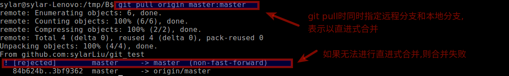

``git pull``
============

``git pull``\ 命令用于拉取指定的远程仓库中的指定分支到本地, 并和本地分支合并.

``git pull`` = ``git fetch`` + ``git merge FETCH_HEAD``, ``git pull``\ 使用给定的参数运行\ ``git fetch``,  并调用\ ``git merge``\ 将检索到的\ **分支头**\ 合并到当前分支中.
``git pull``\ 拉取分支时, 连同历史一起拉取; 但是和本地分支合并时, 合并的只是分支头, 即当前分支commit.

基本语法:

    .. code-block:: sh

        git pull <remote_repo> <remote_branch>:<local_branch>

``git pull <remote_repo> <remote_branch>:<local_branch>``\ 这种语法形式, 即同时给出远程分支和本地分支, 
表示以直进式合并的方式合并远程分支, 即直接将本地分支指向远程分支, 不会生成合并commit;

如果无法以直进式合并来合并远程分支, 则合并失败.

**应该尽量使用git pull拉取远程分支合并到当前分支.**

.. code-block:: sh

    # 不指定本地分支, 表示拉取远程分支合并到当前分支
    # 生成一个新的合并commit
    git pull <remote_repo> <remote_branch>

* 默认情况下, ``git pull``\ 使用\ ``git merge``\ 合并拉取的远程分支, 也可以使用\ ``--rebase``\ 选项, 运行\ ``git rebase``\ 来合并;

* 省略\ ``:``\ 和\ ``<local_branch>``\ , 表示获取指定的远程分支与当前分支合并(**推荐的使用方式, git pull总是用于当前分支**);

* 如果当前分支与远程分支存在追踪关系, 可以省略远程分支名: ``git pull <remote_repo>``;

    * 使用命令: ``git branch -vv``\ 查看本地分支追踪的远程分支.

* 如果当前分支只有一个追踪分支, 连远程仓库也可以省略: ``git pull``.

``git fetch``\ 和\ ``git pull``\ 的区别
---------------------------------------

* ``git fetch``\ 获取远程分支到本地, 但不会自动合并.

* ``git pull``\ 获取远程分支到本地并自动合并.

