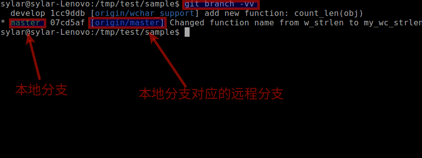

追踪分支
========

什么是追踪分支?
---------------

**在Git中, 追踪分支是用与联系本地分支和远程分支的.
如果在追踪分支(Tracking Branches)执行推送(push)或拉取(pull)时, 它会自动推送或拉取到关联的远程分支上.**

.. note::

    追踪分支就是和远程分支关联的本地分支.

如果经常需要推送本地分支到远程分支或者从远程仓库里拉取分支到本地, 
并且不想很麻烦的使用\ ``git push``\ 和\ ``git pull``\ 的完整格式, 那么就应当使用\ *追踪分支(Tracking Branches)*\ .

查看本地分支关联的远程分支
--------------------------

.. code-block:: sh
    :emphasize-lines: 2

    # 注意, 两个v
    git branch -vv

创建追踪分支
------------

* 克隆远程版本库时, ``git clone``\ 命令会自动在本地建立一个\ ``master``\ 分支, 它是\ ``origin/master``\ 的追踪分支; 

* 以远程分支作为\ *start point*\, 使用\ ``git branch``\ 命令创建一个分支时, 创建的本地分支自动成为该远程分支的追踪分支;

.. code-block:: sh
    :emphasize-lines: 3

    # 以远程分支origin/develop为start point创建本地的develop分支
    # 本地的develop分支自动成为远程分支origin/develop的追踪分支
    git branch develop origin/develop

* 对于已经存在的本地分支, 可以通过以下命令设置其关联的远程分支:

.. code-block:: sh
    :emphasize-lines: 3

    # 设置本地分支关联的远程分支
    # 如果省略本地分支, 表示当前分支
    git branch --set-upstream-to=<remote_branch> <local_branch>

* 使用\ ``git push``\ 命令时使用\ ``-u``\ 选项, 表示把推送的远程分支设置为\ ``upstream``.

.. code-block:: sh
    :emphasize-lines: 2

    # -u = set upstream
    git push -u origin master

撤销本地分支关联的远程分支
--------------------------

.. code-block:: sh
    :emphasize-lines: 3

    # 撤销本地分支关联的远程分支
    # 如果省略本地分支名, 表示当前分支
    git branch --unset-upstream <local_branch>

``upstream``\ 和\ ``downstream``
--------------------------------

``upstream``\ 和\ ``downstream``\ 是关于建立了关联的本地分支和远程分支的概念.

    * 远程分支是本地分支的\ ``upstream``\ ;
    * 本地分支是远程分子的\ ``downstream``\ .

